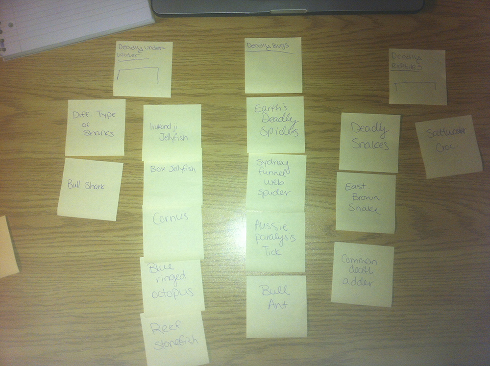
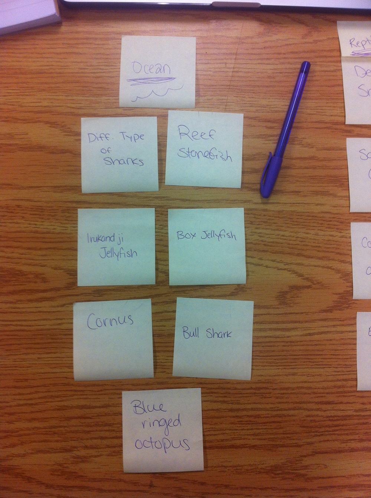
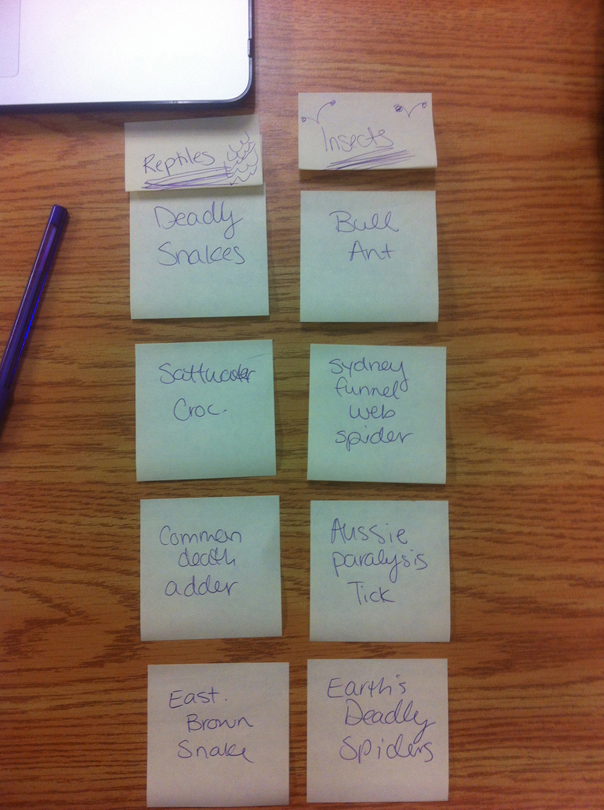

#Card Sort Report

The purpose of this card sort was to help determine a common navigation patterns/categories from the content of my large data website, regarding Australia's Deadliest Animals!

## Specifics

The card sort was conducted by Kathryn Hallett on September 10, 2013, between the times of 3:00pm and 6:00pm, with the following participants:

- Tirzah Wood
- Gracie Walker

## Cards

1. Different Types of Sharks
2. Bull Shark
3. Irukandi Jellyfish
4. Box Jellyfish
5. Cornus
6. Blue Ringed Octopus
7. Reef Stonefish
8. Deadly Spiders
9. Sydney Funnel Web Spider
10. Australian Paralysis Tick
11. Bull Ant
12. Deadly Snakes
13. Eastern Brown Snake
14. Common Death Adder
15. Saltwater Crocodile

## Card Sort Results 

*Card sort by Tirzah Wood*

*Card sort by Gracie Walker*

## Observations

- Content should be arranged corresponding to the type of animal category they fall under
- Both card sorts categorized by ocean, reptiles and insects
